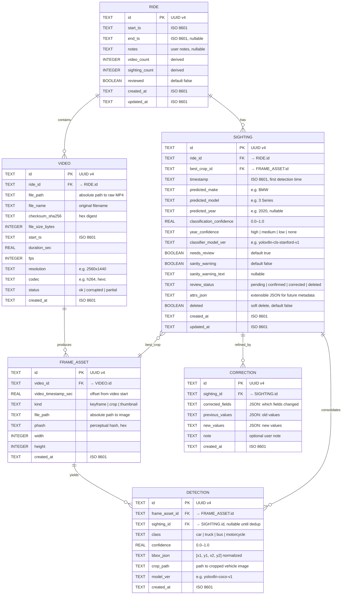

# Data Model: Local Pipeline MVP

**Feature**: `001-local-pipeline-mvp`
**Date**: 2026-02-21
**Storage**: SQLite (WAL mode) at `~/CurbScout/curbscout.db`

## Entity Relationship Diagram



## Indexes

```sql
-- Performance-critical queries
CREATE INDEX idx_video_ride_id ON VIDEO(ride_id);
CREATE INDEX idx_video_checksum ON VIDEO(checksum_sha256);
CREATE INDEX idx_frame_asset_video_id ON FRAME_ASSET(video_id);
CREATE INDEX idx_frame_asset_phash ON FRAME_ASSET(phash);
CREATE INDEX idx_detection_frame_asset_id ON DETECTION(frame_asset_id);
CREATE INDEX idx_detection_sighting_id ON DETECTION(sighting_id);
CREATE INDEX idx_sighting_ride_id ON SIGHTING(ride_id);
CREATE INDEX idx_sighting_review_status ON SIGHTING(review_status);
CREATE INDEX idx_sighting_make_model ON SIGHTING(predicted_make, predicted_model);
CREATE INDEX idx_correction_sighting_id ON CORRECTION(sighting_id);
```

## Schema Meta Table

```sql
CREATE TABLE _schema_meta (
  key TEXT PRIMARY KEY,
  value TEXT NOT NULL
);

INSERT INTO _schema_meta (key, value) VALUES ('schema_version', '1');
INSERT INTO _schema_meta (key, value) VALUES ('created_at', '2026-02-21T00:00:00Z');
INSERT INTO _schema_meta (key, value) VALUES ('app_name', 'CurbScout');
```

## Access Patterns

### Python Pipeline (Writer)
1. **Ingest**: INSERT into RIDE, VIDEO (check checksum_sha256 uniqueness first).
2. **Frame Sampling**: INSERT into FRAME_ASSET.
3. **Detection**: INSERT into DETECTION.
4. **Classification**: INSERT into SIGHTING, UPDATE DETECTION.sighting_id.
5. **Dedup**: UPDATE DETECTION.sighting_id to merge detections → sightings.

### GCP Sync Daemon (Reader) & Local API
1. **Sync to Firestore**: Query recent/un-synced `RIDE` and `SIGHTING` records, push to GCP Firestore.
2. **Sync to GCS**: Push `FRAME_ASSET` (crops) to GCS bucket for global accessibility.
3. **Local Browse**: Local API can still serve SELECT from RIDE/SIGHTING for offline debugging.
4. **Pull Corrections**: Sync daemon polls Firestore for `CORRECTION` records created via the Cloud Run UI and applies updates to the local `SIGHTING` rows.

### Note on SwiftData
- SwiftData is deferred to Phase 8 (native macOS app).
- For MVP, both pipeline and API use Python `sqlite3` directly.
- If SwiftData is added later, it reads the same SQLite file.

### WAL Mode
- Enable WAL (Write-Ahead Logging) mode for concurrent read/write:
  FastAPI reading while Python pipeline writes.
- API should use `PRAGMA busy_timeout = 5000;` to retry on lock.
- Pipeline should batch INSERTs in transactions (100–500 rows per tx).
- `PRAGMA journal_mode=WAL;`

## File System Layout

```
~/CurbScout/
├── curbscout.db             # SQLite database (WAL mode)
├── curbscout.db-wal         # WAL file (auto-managed)
├── curbscout.db-shm         # Shared memory (auto-managed)
├── raw/                     # Raw MP4 files, organized by date
│   ├── 2026-02-21/
│   │   ├── VID_20260221_143000.mp4
│   │   └── VID_20260221_150000.mp4
│   └── .partial/            # Incomplete transfers (quarantine)
├── derived/                 # Pipeline outputs
│   ├── frames/              # Extracted keyframes
│   │   └── 2026-02-21/
│   │       ├── frame_000001.jpg
│   │       └── ...
│   └── crops/               # Cropped vehicle images
│       └── 2026-02-21/
│           ├── det_uuid_crop.jpg
│           └── ...
├── exports/                 # Daily report bundles
│   └── 2026-02-21/
│       ├── sightings.jsonl
│       ├── sightings.csv
│       ├── crops/
│       └── index.html
└── models/                  # ML model files
    ├── yolov8n.mlmodel      # Detection model (CoreML)
    ├── yolov8n-cls-cars.mlmodel  # Classification model (CoreML)
    └── sanity_check.json    # Make/model/year validity lookup
```
