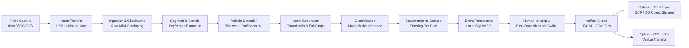
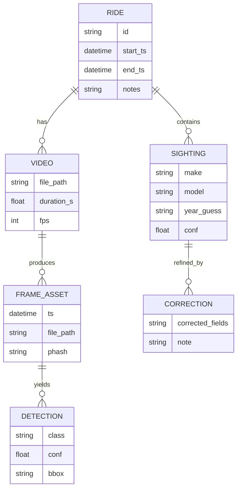

<div align="center">
  <h1>📸 CurbScout</h1>
  <p><b>Local‑first ride video → structured city intel.</b></p>
  
  [](https://blueoakcouncil.org/license/1.0.0)
  []()
  []()
  []()
  []()
  []()
</div>

---

## 🚀 Overview

CurbScout is a **solo, local-first pipeline** that automates the extraction of city-level intelligence from action camera footage. 

You ride your bike with a tiny camera (like the Insta360 GO 3S), come home, and plug it in. Your Mac takes over—ingesting raw 4K video, running local inference to detect and classify **car sightings** (make/model now; year/trim later), and compiling a queryable database of events.

Eventually, this system evolves into comprehensive **"curb intelligence,"** capable of mapping parking restrictions, street sweeping schedules, and road hazards, all reviewed through a premium, Apple-beautiful macOS UI and modern web dashboard.

---

## 🧠 Why This Architecture?

**The Constraints:** You have an M4 Mac mini (24GB) and a slow coax internet connection. 
**The Solution:** Process heavy workloads strictly on the edge. Raw 4K footage never leaves your house. The pipeline runs locally and syncs only hyper-optimized, derived artifacts (JSON, thumbnail crops, highlight snippets) to cloud storage (GCP/DigitalOcean). Expensive training or massive batch reprocessing jobs are systematically delegated to rented burst GPUs via Vast.ai.

---

## ⚙️ How It Works (ELI15 & Expert)

### 🧩 ELI15
1. Ride your bike wearing a small camera on your chest.
2. Come home and plug it into your Mac.
3. Your Mac automatically reads the video and generates a detailed "cars I saw today" report with timestamps and pictures.
4. You click through to correct any wrong labels.
5. In the future, the system will read parking signs and warn you exactly where and when you can legally park.

### 🔬 Expert 
A spec-driven, event-sourced perception pipeline operating under constrained uplink. The core flow:
`Ingest → Segment → Sample Frames → Detect → Crop → Classify → Dedupe → Persist → Human-in-the-Loop Corrections → Exports → Optional Sync`

This design stays cheap by pushing only necessary artifacts through the coax bottleneck and scales effortlessly by utilizing Vast.ai "real-time pricing" for resource-heavy GPU training loops.

---

## 🛠 Hardware Stack & Constraints

- **🖥 Compute**: Always-on M4 Mac mini (24GB). Handles ingestion, continuous local inference, and database/UI hosting.
- **📷 Capture**: Insta360 GO 3S + Action Pod. [Battery expectations](https://onlinemanual.insta360.com/go3s/en-us/faq/specs/battery): ~38 min camera-only, ~140 min in Action Pod. 
- **☁️ Cloud Sync**: GCP/DigitalOcean object storage + static hosting. Raw footage never ships over coax.
- **🚀 GPU Bursting**: Vast.ai on-demand compute instances. 5-6x lower cost than traditional clouds, used strictly for training and heavy batch jobs.

---

## 🎥 Camera Placement (Cars-First)

### 🧩 ELI15
Put it on your chest so it points where you look; it’s steadier than the handlebars and usually captures cars clearly.

### 🔬 Expert Notes
- **Primary Mount (Chest/Centerline)**: Delivers stable optical flow, consistent horizon, and fewer handlebar micro-vibrations. Maintain a slight downward pitch to maximize plates/badges and minimize sky overexposure.
- **Secondary Mount (Helmet POV)**: Excellent for higher vantage points (over parked cars at intersections). Validate that the lens isn’t occluded by strap configurations. Expect additional head jitter tracking.
- **Safety/Retention**: Magnetic/wearable mounts [can occasionally fail](https://me.pcmag.com/en/cameras-1/24131/insta360-go-3s) in rough use. Always employ a mechanical backup tether when on the road.

---

## 💾 Phase 1 Transfer (USB Drive Mode)

We explicitly built Phase 1 to operate entirely as an offline "get home → transfer" process. **No cloud dependency, no phone hotspot requirement.**

### Phase 1A (Recommended): U-Disk Mode to Mac
Insta360’s native configuration enables transfers via [U-Disk/USB Drive Mode](https://onlinemanual.insta360.com/go3/en-us/operating-tutorials/connect/files). Copy files directly from `DCIM > Camera01`.

```bash
# Example local folder layout (run once)
mkdir -p ~/CurbScout/{raw,derived,exports,models}
```

### Phase 1B (Optional): Quick Reader Accessories
For individuals wanting a faster, "SD card-like" workflow that bypasses camera Wi-Fi, the GO 3S [Quick Reader](https://www.cyclegear.com/accessories/insta360-go-3go-3s-quick-reader) is available for roughly **$45 USD**. It brings rapid removable media capability to an enclosed device.

---

## 📊 System Architecture

### End-to-End Dataflow


### Component Breakdown
```mermaid
flowchart TB
  subgraph Mac[M4 Mac mini (local-first)]
    W[Folder watcher\nIngest daemon]
    P[Pipeline runner\nsegment/sample/detect/classify]
    DB[(SQLite)]
    UI[SwiftUI macOS app\nReview/Correction]
    EX[Exporter\nreports + bundles]
    W --> P --> DB
    DB <--> UI
    DB --> EX
  end

  subgraph Cloud[Later phases: Cloud]
    OBJ[(Object Storage\nGCP/DO)]
    WEB[SvelteKit dashboard\n(optional)]
    GPU[Vast.ai GPU jobs\n(train/batch)]
  end

  EX --> OBJ
  OBJ --> WEB
  GPU --> OBJ
```

### Minimum Viable Data Schema
Structured to track rides, assets, detections, and human corrections for active ML learning.



---

## 📂 Output Artifacts (Storage Strategy)

### 🧩 ELI15
Keep the massive video files sitting safely on your Mac. When synced online, the app only moves the "small stuff" (pictures + text) so it never crashes your home internet.

### 🔬 Expert Notes
- **Local (Always):** Raw MP4 footage, derived crops, all keyframes, SQLite Database.
- **Cloud (Deferred):** "Daily Bundles" comprising a `sightings.jsonl`, miniature thumbnails/crops, compressed highlight clips, and static HTML reports.

---

## 🎯 Realistic Recognition Scope

The MVP targets absolute reliability for common vehicle profiles (e.g., "BMW 3 Series" or "Honda Civic"). Fine-grained spec classification (exact year/trim/brake package) is treated as a best-effort metric driven by user correction and future model fine-tuning. A deterministic "sanity checker" automatically flags impossible manufacturer year/badge combinations for human review.

---

## 🎨 Premium Review Experience

Because speed and efficiency are paramount for a solo maintainer, the human-in-the-loop review interface is built to Apple-grade standards. 

Phase 1 relies on a sophisticated **SwiftUI macOS app** tailored for keyboard-driven navigation—featuring a timeline scrubber, integrated maps, and a seamless grid of crops for rapid, one-keystroke confirmations. Future iterations will introduce a bespoke SvelteKit web dashboard for remote analytics, but native macOS provides the latency requirements to make labeling feasible solo.

---

## 💸 Cloud & Cost Posture

- **Vast.ai** is purely "on-demand." Utilized exclusively for model training, architectural experiments, and massive batch reprocessing. Pricing fluctuates, but heavily leverages real-time economics against traditional cloud infrastructure.
- **GCP/DO Storage** is configured as dumb object storage. We purposefully avoid keeping persistent GPU servers idling online.

---

## 🅿️ Expanding Into "Curb Intelligence"

Santa Monica's curb usage code changes regularly. For example, [Clean Air Vehicle Decals' free meter benefits expire in late 2025](https://www.santamonica.gov/press/2025/09/23/local-parking-benefit-for-clean-air-vehicle-decals-expires-sept-30). 

By extending the pipeline towards reading parking signs, applying OCR, parsing time windows, and attaching metadata to specific map segments, CurbScout progresses into a tangible utility answering: *"Can I legally park here right now?"*

---

## 🛤 Roadmap

### 📦 Phase 1: MVP Local Pipeline (Offline First)
- USB Drive/U-Disk local transfer.
- Folder watcher daemon ingest → local SQLite persistence.
- Complete frame sampling, detection, and basic make/model classification.
- Daily localized export reports.

### 🌐 Phase 2: Autoupload Behaviors (User Configurable)
*(System awaits your configuration decision!)* 
- Option 1: **Home Wi-Fi Only** (Batched uploads strictly at night).
- Option 2: **Opportunistic** (Shooting JSON bounds across cell hotspot, deferring full clips later).
- Option 3: **As-You-Ride** (Aggressive queue uploading. Heavy battery degradation tradeoff).

### 🖥 Phase 3: Analytics Web Dashboard
Development of a robust SvelteKit dashboard application for rendering maps, searching complex metadata tags, and optionally requiring authorization per viewer.

### 🔥 Phase 4: Vast.ai Active Learning
Creating automated feedback loops. Shipping your manual macOS UI labeling corrections directly to Vast.ai to re-train the model, pipe the weights back to the local Mac cache, and reprocess previous runs invisibly.

### 🏙 Phase 5: Curb Intelligence Modules
Incorporating sign OCR algorithms, integrating street sweeper transit mapping, mapping persistent road hazards, tracing ad-hoc construction, and analyzing bike lane blockages utilizing the existing spatiotemporal event architecture.

---

## 🛡 Security & Privacy Posture

- **Absolute Local-First**: Raw footage data never automatically touches the cloud. Syncs deploy solely derived, stripped artifacts.
- **Privacy By Default**: Sensitive PII elements (like license plates or incidental face captures) are explicitly hashed/tokenized upon detection if tracked for deduplication. Clear-text ingestion requires conscious user opt-in.

---

## 🤝 Project Specification via Spec Kit

CurbScout employs a rigorous, spec-driven development lifecycle via GitHub Spec Kit. This keeps solo-developer scope creep contained and feature architectures deeply considered.

```bash
uvx --from git+https://github.com/github/spec-kit.git specify init curbscout
```

```text
/speckit.specify Build a local-first macOS app that ingests Insta360 GO 3S ride videos via USB Drive/U-Disk at home, extracts car sightings (make/model now, best-effort year/trim later), stores in SQLite, provides SwiftUI review/correction UI, and exports a daily report bundle (JSONL/CSV + crops + highlight clips). Cloud sync and Vast.ai training are later phases.
/speckit.plan Phase 1: home transfer + local pipeline + review UI. Phase 2+: autoupload modes, SvelteKit dashboard, Vast.ai training loop. Phase 5: parking sign OCR and rule parsing for Santa Monica.
```

<div align="center">
  <br/>
  <b>Built locally, for the streets.</b><br/>
  Maintainer: <a href="https://github.com/ParkWardRR">ParkWardRR</a>
</div>
