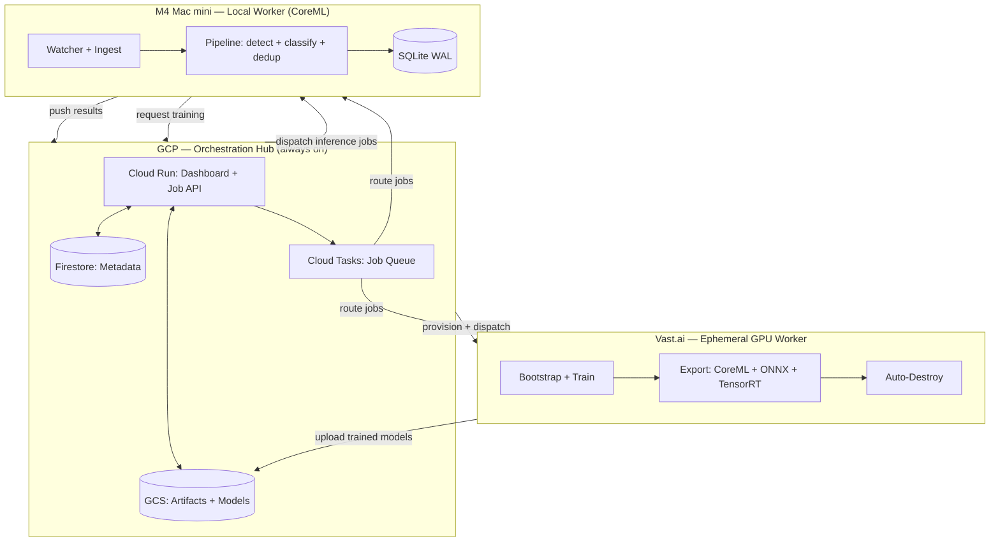
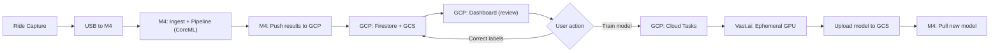
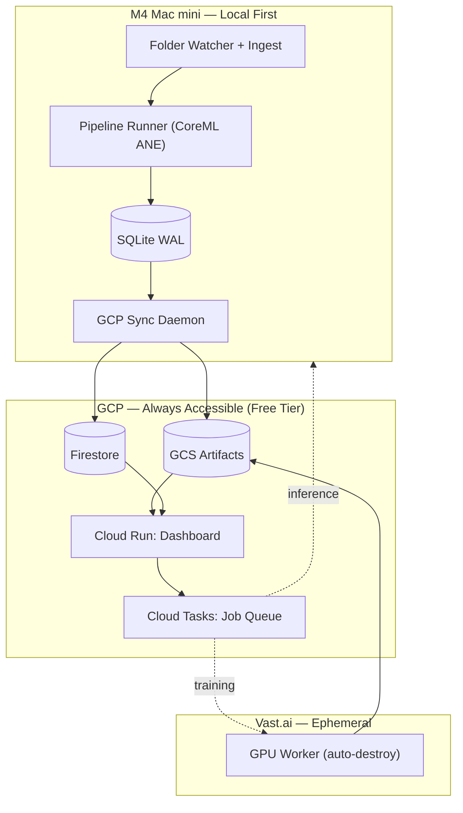
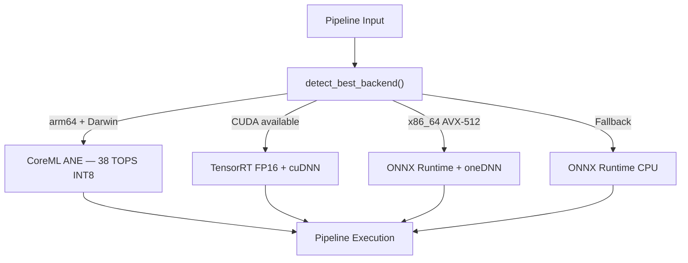
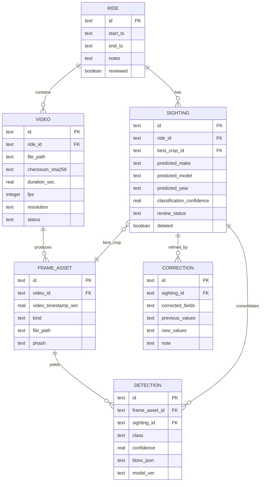

<div align="center">

# CurbScout

**GCP-orchestrated perception pipeline — ride video to structured city intelligence.**

**All 7 phases implemented** — vehicle detection, curb intelligence, active learning, multi-device fleet, and native macOS app.

[](https://blueoakcouncil.org/license/1.0.0)
[](https://python.org)
[](https://kit.svelte.dev)
[](https://sqlite.org)
[](https://fastapi.tiangolo.com)
[]()
[]()
[]()
[]()
[]()
[]()
[]()
[]()
[]()
[]()
[]()

<br/>

*Ingest daily Insta360 GO 3S cycling footage on an M4 Mac mini.*
*Detect, classify, and catalog every vehicle sighting — locally.*
*Review from anywhere via GCP-hosted dashboard. Burst to NVIDIA GPUs when ready.*

</div>

---

## Table of Contents

- [Overview](#overview)
- [Architecture](#architecture)
- [Hardware Platform](#hardware-platform)
- [Capture Device](#capture-device)
- [Camera Placement](#camera-placement)
- [Data Transfer](#data-transfer)
- [Pipeline Stages](#pipeline-stages)
- [Machine Learning Stack](#machine-learning-stack)
- [Hardware Acceleration](#hardware-acceleration)
- [Vast.ai GPU Infrastructure](#vastai-gpu-infrastructure)
- [Database Schema](#database-schema)
- [Review Interface](#review-interface)
- [Export System](#export-system)
- [File System Layout](#file-system-layout)
- [Vehicle Recognition](#vehicle-recognition)
- [Deduplication Strategy](#deduplication-strategy)
- [Security and Privacy](#security-and-privacy)
- [Curb Intelligence](#curb-intelligence)
- [Active Learning Loop](#active-learning-loop)
- [Multi-Device Fleet](#multi-device-fleet)
- [Native macOS Application](#native-macos-application)
- [Roadmap](#roadmap)
- [Cost Analysis](#cost-analysis)
- [Specification Kit](#specification-kit)
- [Contributing](#contributing)
- [License](#license)

---

## Overview

CurbScout is a three-tier perception system for extracting structured urban data from action camera footage. It processes raw 4K video captured during daily cycling commutes, identifies every vehicle in frame, classifies each by make and model, deduplicates repeated sightings, and persists the results into a queryable database. Beyond vehicles, CurbScout performs **parking sign OCR**, **hazard mapping**, and **storefront change detection** — turning raw ride footage into actionable curb intelligence. The system self-improves through an **automated active learning pipeline** that trains new models from user corrections, and supports **multi-device fleet collaboration** with real-time worker status monitoring. A **native macOS SwiftUI application** provides local-first sighting review with frame-accurate video scrubbing.

The system uses a **hub-and-spoke architecture** with GCP as the central orchestration layer:

- **GCP (Hub)** — Always-on SvelteKit dashboard + job orchestration API hosted on Cloud Run. Firestore for metadata, GCS for artifacts, Cloud Tasks for job dispatch. Accessible from any browser, anywhere.
- **M4 Mac mini (Local Worker)** — Runs the full perception pipeline locally via CoreML ANE at zero marginal cost. Ingests camera footage, detects and classifies vehicles, pushes results back to GCP. Can also push training requests to GCP for forwarding to Vast.ai.
- **Vast.ai (Ephemeral GPU Worker)** — Provisioned on-demand by GCP when the user dispatches a training or batch reprocessing job. Auto-destroys after completion. Never running unless explicitly requested.

**Build order**: GCP orchestration first (dashboard, Firestore schema, job API). Then M4 pipeline and Vast.ai worker in parallel, both reporting to GCP.

---

## Architecture

### Three-Tier Orchestration



### Job Flow



### Component Architecture



### Acceleration Dispatch



---

## Hardware Platform

CurbScout targets Apple Silicon as the primary inference platform with NVIDIA CUDA GPUs reserved for training and batch reprocessing workloads.

### Primary: M4 Mac mini (24 GB)

| Component | Specification | Pipeline Role |
|:---|:---|:---|
| **Neural Engine** | 16-core, 38 TOPS (INT8) | YOLOv8 detection, EfficientNet classification |
| **GPU** | 10-core, 4.5 TFLOPS FP32 | Fallback inference, image preprocessing |
| **CPU** | 4P + 6E cores, ARMv9.2-A | Pipeline orchestration, hashing, database I/O |
| **SME** | 512-bit matrix ops, BFloat16 | Custom matrix multiply kernels |
| **NEON SIMD** | 128-bit per core, 4 ALUs | Image resize, pHash, channel conversion |
| **Media Engine** | Hardware H.264/H.265 decode | VideoToolbox frame extraction |
| **Unified Memory** | 24 GB, 120 GB/s bandwidth | Zero-copy transfer between CPU/GPU/ANE |

The M4 Neural Engine delivers approximately **92.6 FPS** on YOLOv8n INT8 detection and over **350 classifications per second** on EfficientNet-B4, making real-time local inference feasible for a 2 FPS sampling rate without any cloud dependency.

### Burst: Vast.ai GPU Fleet (On-Demand)

| GPU | VRAM | Detection FPS | Training Speed | Typical Cost |
|:---|:---|:---|:---|:---|
| **RTX 4090** | 24 GB GDDR6X | ~580 FPS (TensorRT INT8) | ~4 min/epoch | $0.27–0.40/hr |
| **RTX 3090** | 24 GB GDDR6X | ~310 FPS (TensorRT INT8) | ~7 min/epoch | $0.11–0.16/hr |
| **A100 80 GB** | 80 GB HBM2e | ~400 FPS (TensorRT FP16) | ~2.5 min/epoch | $0.50–0.80/hr |

GPU instances are provisioned exclusively for training runs and large-scale batch reprocessing. No persistent cloud compute runs on behalf of the pipeline.

---

## Capture Device

### Insta360 GO 3S

| Attribute | Value |
|:---|:---|
| **Sensor** | 1/2.3-inch CMOS |
| **Max Video Resolution** | 4K (3840×2160) at 24/25/30 fps |
| **Additional Modes** | 2.7K at 50 fps, 1080p at 200 fps (slow motion) |
| **Photo Resolution** | 12 MP (4000×3000 at 4:3) |
| **Codec Output** | H.264 / H.265, 8-bit 4:2:0 |
| **Storage** | Internal (no removable media) |
| **Battery — Camera Only** | ~38 minutes |
| **Battery — With Action Pod** | ~140 minutes |
| **Camera Weight** | 39.1 g (1.38 oz) |
| **Camera + Action Pod Weight** | 135.4 g (4.78 oz) |
| **Stabilization** | FlowState electronic stabilization |
| **Connectivity** | USB-C, Bluetooth 5.0, Wi-Fi |
| **Water Resistance** | IPX8 (10 m) |
| **Transfer Mode** | U-Disk / USB Drive Mode via USB-C |

The GO 3S captures stabilized 4K footage from a magnetic chest mount during cycling. At a typical ride duration of 30–50 minutes, a single commute generates approximately 8–15 GB of raw footage.

---

## Camera Placement

### Recommended: Chest Mount (Centerline)

The chest or torso centerline position is optimal for vehicle-focused data capture. This placement delivers:

- **Stable optical flow** — minimal handlebar vibration transfer
- **Consistent horizon** — reduces per-frame alignment correction
- **Optimal pitch** — a slight downward angle maximizes the capture of license plates, badges, and grilles while reducing sky overexposure
- **Natural gaze following** — the camera tracks the rider's upper body orientation, which naturally tracks traffic

### Alternative: Helmet or Head Mount

Higher vantage points improve visibility over parked vehicles at intersections and in dense urban parking. However, this position introduces additional rotational jitter from head movement that may reduce crop quality for small or distant vehicles.

### Safety Considerations

Magnetic and clip-based wearable mounts have been documented to detach under rough riding conditions. A secondary mechanical tether (lanyard or carabiner backup) is recommended for all on-road use. Verify that the mount does not obstruct peripheral vision or interfere with helmet fit.

---

## Data Transfer

### Phase 1A — USB Drive Mode (Recommended)

The Insta360 GO 3S supports a native U-Disk / USB Drive Mode that presents the camera as an external storage device when connected via USB-C. Video files are located under `DCIM/Camera01/` following the naming convention `VID*.mp4` for stabilized footage and `PRO*.mp4` for FreeFrame (raw/unprocessed) footage.

For MVP, the pipeline processes only `VID*.mp4` files. FreeFrame support is deferred.

```bash
# One-time directory setup
mkdir -p ~/CurbScout/{raw,derived,exports,models}
```

The ingest daemon automatically detects new files on the mounted drive, computes SHA-256 checksums, performs streaming copy to `~/CurbScout/raw/YYYY-MM-DD/`, and creates corresponding `RIDE` and `VIDEO` records in the local database. Previously imported files (matched by checksum) are silently skipped.

### Phase 1B — Quick Reader Accessory (Optional)

For faster offload without relying on camera Wi-Fi, the Insta360 GO 3S Quick Reader provides an SD-card-style removable media workflow. Retail pricing is approximately **$45 USD**.

---

## Pipeline Stages

The pipeline executes as a sequential, deterministic process. Each stage logs its inputs, outputs, timestamps, and model version for full auditability. Re-processing the same video with the same model version produces identical results.

### Stage 1: Ingest

- Detect mounted Insta360 drive or watch `~/CurbScout/raw/` for new files
- Compute SHA-256 checksum (hardware-accelerated via ARM SHA extensions on M4)
- Streaming copy to `~/CurbScout/raw/YYYY-MM-DD/` (no full-file memory load)
- Validate file integrity via `ffprobe`; quarantine corrupted files to `.partial/`
- Create `RIDE` and `VIDEO` database records

### Stage 2: Frame Sampling

- Extract keyframes at a configurable rate (default: 2 FPS)
- Hardware-accelerated decode via VideoToolbox on macOS, software ffmpeg elsewhere
- At 2 FPS from a 30 FPS source, processing load is 6.7% of raw frames
- A 30-minute ride at 2 FPS yields approximately 3,600 frames
- Output: JPEG keyframes in `~/CurbScout/derived/frames/YYYY-MM-DD/`

### Stage 3: Vehicle Detection

- Run YOLOv8n on each extracted frame
- Backend auto-selected: CoreML ANE (M4), TensorRT (CUDA GPU), ONNX Runtime (CPU)
- Filter detections to vehicle classes only: car, truck, bus, motorcycle
- Store bounding box coordinates, confidence score, and model version
- At ~93 FPS on M4 ANE, 3,600 frames process in approximately 39 seconds

### Stage 4: Crop Generation

- Extract and save individual vehicle crops from detection bounding boxes
- Resize to classifier input dimensions (380×380 for Jordo23, 224×224 for VehicleTypeNet)
- Compute perceptual hash (pHash) for deduplication
- NEON SIMD-accelerated image processing on ARM, AVX2/AVX-512 on x86
- Output: cropped JPEG images in `~/CurbScout/derived/crops/YYYY-MM-DD/`

### Stage 5: Make/Model Classification

- Tiered classification strategy (see [Machine Learning Stack](#machine-learning-stack))
- Primary: Jordo23 EfficientNet-B4 (8,949 classes — make, model, year)
- Fallback: NVIDIA VehicleTypeNet (6 broad types when primary confidence is low)
- Sanity checker flags impossible year/badge combinations for review

### Stage 6: Deduplication

- Consolidate multiple detections of the same physical vehicle into a single `SIGHTING`
- Uses temporal proximity, spatial overlap (IoU), and perceptual hash similarity
- Typical reduction: 500+ raw detections → ≤100 unique sightings per ride

### Stage 7: Persist

- Write all entities to SQLite with WAL mode for concurrent read/write
- Batch inserts in transactions (100–500 rows per transaction)
- Record pipeline run metadata: model versions, processing duration, stage counts

---

## Machine Learning Stack

### Pre-Trained Models (Day 1 — No Training Required)

| Model | Architecture | Classes | Input Size | Dataset | Format | Size |
|:---|:---|:---|:---|:---|:---|:---|
| **YOLOv8n** | YOLO v8 Nano | COCO vehicle classes | 640×640 | COCO | CoreML / ONNX / TensorRT | ~6 MB |
| **Jordo23/vehicle-classifier** | EfficientNet-B4 | 8,949 (make+model+year) | 380×380 | VMMRdb | PyTorch / ONNX / CoreML | ~75 MB |
| **NVIDIA VehicleTypeNet** | ResNet-18 | 6 (sedan/SUV/truck/van/coupe/large) | 224×224 | NVIDIA proprietary | ONNX / TensorRT | ~45 MB |

### Classification Pipeline

```
Detection Crop
    │
    ├── Tier 1: Jordo23 EfficientNet-B4 (8,949 classes)
    │     → make, model, year, confidence
    │     → If confidence ≥ 0.5: accept as primary prediction
    │
    ├── Tier 2: VehicleTypeNet (fallback when Tier 1 < 0.5)
    │     → vehicle type: sedan, SUV, truck, van, coupe, large vehicle
    │     → Stored alongside Tier 1 prediction
    │
    └── Sanity Checker
          → Validate year/badge combinations against lookup table
          → Flag impossible combos (e.g., "BMW 440i 2004" — 4 Series began 2014)
```

### Model Format Matrix

Every model is exported to multiple formats from a single `.pt` source to support all deployment targets:

| Platform | Format | Acceleration | Quantization | Use Case |
|:---|:---|:---|:---|:---|
| M4 Mac mini | `.mlpackage` | CoreML ANE | INT8 | Day-to-day inference |
| Vast.ai GPU | `.engine` | TensorRT + CUDA | FP16 | Batch reprocessing |
| Any x86 CPU | `.onnx` | ONNX Runtime + AVX-512/AVX2 | FP32 | Portable fallback |
| Any ARM CPU | `.onnx` | ONNX Runtime + NEON | FP32 | Portable fallback |

### Training Datasets

| Dataset | Images | Classes | Notes |
|:---|:---|:---|:---|
| **Stanford Cars** | 16,185 | 196 (make+model+year) | High-quality, clean labels |
| **VMMRdb** | 291,752 | 9,170 | Massive, real-world distribution |
| **CompCars (web)** | 136,726 | 1,716 models × 163 makes | Large but noisier |
| **CurbScout corrections** | Growing | Project-specific | User corrections feed active learning |

---

## Hardware Acceleration

CurbScout automatically detects and dispatches computations to the optimal hardware backend at runtime. No manual configuration is required.

### Acceleration Matrix

| Pipeline Stage | M4 Mac mini | Vast.ai GPU Instance | x86 CPU Fallback |
|:---|:---|:---|:---|
| Frame Extraction | VideoToolbox HW decode | ffmpeg (software) | ffmpeg (software) |
| Vehicle Detection | CoreML ANE (INT8) | TensorRT + CUDA (FP16) | ONNX Runtime + AVX-512 |
| Classification | CoreML ANE (INT8) | TensorRT + CUDA (FP16) | ONNX Runtime + AVX2 |
| Image Preprocessing | ARM NEON SIMD | AVX-512 / AVX2 | AVX2 |
| Perceptual Hashing | ARM NEON (FMA + popcount) | AVX-512 VPOPCNTDQ | Scalar |
| SHA-256 Checksum | ARM SHA extensions (10×) | x86 SHA-NI | OpenSSL |
| Model Training | Not supported (too slow) | CUDA + cuDNN + Tensor Cores | Not supported |
| Batch Reprocessing | CoreML ANE (if idle) | CUDA TensorRT (bulk) | ONNX Runtime |

### M4 CoreML Performance Benchmarks

| Model | Format | Compute Unit | Throughput | Latency |
|:---|:---|:---|:---|:---|
| YOLOv8n Detection | CoreML INT8 | ANE | 92.6 FPS | 10.8 ms |
| YOLOv8n Detection | CoreML FP16 | ANE | 78.3 FPS | 12.8 ms |
| YOLOv8n Detection | ONNX FP32 | CPU | 42.1 FPS | 23.7 ms |
| EfficientNet-B4 Classification | CoreML INT8 | ANE | ~350/sec | 2.9 ms |
| EfficientNet-B4 Classification | ONNX FP32 | CPU | ~120/sec | 8.3 ms |
| VehicleTypeNet ResNet-18 | ONNX FP32 | CPU + NEON | ~500/sec | 2.0 ms |

### ARM NEON SIMD Operations

The following operations are automatically vectorized on Apple Silicon through well-maintained library integrations (Pillow, NumPy, OpenCV, imagehash):

| Operation | NEON Intrinsics | Speedup vs. Scalar |
|:---|:---|:---|
| Bilinear image resize | `vld1q_u8`, `vmull_u8`, `vaddq_u16` | 4–8× |
| BGR → RGB channel swap | `vld3q_u8` (deinterleave), `vst3q_u8` | 6× |
| Normalize to [0, 1] | `vcvtq_f32_u32`, `vmulq_f32` | 4× |
| Perceptual hash (DCT) | `vfmaq_f32` (fused multiply-add) | 3–5× |
| Hamming distance | `vcntq_u8` (popcount), `vpaddlq` | 8× |
| SHA-256 checksum | Hardware SHA extensions | 10× |

### AVX-512 / AVX2 on Vast.ai Instances

Vast.ai instances typically run on Intel Xeon or AMD EPYC CPUs with AVX2 (256-bit) and in many cases AVX-512 (512-bit) support. While GPU inference is the primary execution path, CPU-side operations benefit from these SIMD extensions:

- **Image preprocessing**: Batch resize and normalization before GPU inference
- **ONNX Runtime CPU**: Fallback inference with AVX-512 + VNNI acceleration
- **Perceptual hashing**: AVX-512 VPOPCNTDQ processes 16 hash comparisons per instruction
- **Data loading**: AVX2-accelerated memory copy for batch tensor assembly

---

## Vast.ai GPU Infrastructure

CurbScout includes a production-grade GPU fleet orchestration toolkit adapted from battle-tested deployment infrastructure. The toolkit supports fully autonomous operation: provision, train, export, sync, and self-destruct — without manual SSH intervention.

### Training Architecture

```
Local Mac (M4 mini)                    Vast.ai Instance (RTX 4090)
───────────────────                    ────────────────────────────
1. Export labeled dataset               onstart → bootstrap_training.sh
   (corrections → training data)        ├── Install ultralytics + deps
                                        ├── Download dataset from GCS
2. Upload dataset to GCS               ├── Download base model
   gs://curbscout/training/v1/          ├── Fine-tune classifier
                                        │   (Stanford Cars + corrections)
3. Launch Vast.ai instance             ├── Export models:
   vastctl launch                       │   → .mlpackage (CoreML INT8)
                                        │   → .engine (TensorRT FP16)
4. Walk away                           │   → .onnx (universal fallback)
                                        ├── Upload results to GCS
5. Download trained model              └── Auto-destroy instance
   from GCS → ~/CurbScout/models/
```

### CUDA + TensorRT Stack

| Component | Version | Purpose |
|:---|:---|:---|
| **CUDA Toolkit** | 12.4 | GPU compute runtime |
| **cuDNN** | 9.x | Deep learning primitives |
| **TensorRT** | 10.x | Inference optimization (FP16/INT8) |
| **PyTorch** | 2.5.1 | Training framework |
| **Ultralytics** | Latest | YOLOv8 training and export |
| **ONNX Runtime** | Latest | Cross-platform inference |

### GPU Instance Performance

| Task | RTX 4090 | RTX 3090 | M4 CoreML |
|:---|:---|:---|:---|
| YOLOv8n Detection (FP16) | ~320 FPS | ~180 FPS | ~93 FPS |
| YOLOv8n Detection (TensorRT INT8) | ~580 FPS | ~310 FPS | ~93 FPS (ANE INT8) |
| EfficientNet-B4 Classification | ~800/sec | ~450/sec | ~350/sec |
| YOLOv8n-cls Training (per epoch) | ~4 min | ~7 min | ~25 min (MPS) |
| Batch 1,000 Crops Classify | ~1.3 sec | ~2.2 sec | ~2.9 sec |

### Deploy Kit Components

The Vast.ai deploy kit provides end-to-end GPU fleet management:

| Component | Description |
|:---|:---|
| [`bootstrap_training.sh`](.specify/vastai-deploy-kit/scripts/bootstrap_autonomous.sh) | Autonomous instance lifecycle: install → download → train → export → upload → self-destruct |
| [`instant_gcs_sync.sh`](.specify/vastai-deploy-kit/scripts/instant_gcs_sync.sh) | inotifywait-based real-time upload with drain-safe auto-kill |
| [`vast-sync-v4.sh`](.specify/vastai-deploy-kit/scripts/vast-sync-v4.sh) | SSH-based polling sync with metadata and gallery integration |
| [`auto-shutdown.sh`](.specify/vastai-deploy-kit/scripts/auto-shutdown.sh) | Four-phase shutdown: wait → sync → verify → destroy |
| [`ph-autokill.sh`](.specify/vastai-deploy-kit/scripts/ph-autokill.sh) | TTL-based safety guard (12-hour default maximum) |
| [`fleet_poll.py`](.specify/vastai-deploy-kit/scripts/fleet_poll.py) | Vast.ai API poller with fleet status JSON output |

### Go SDK for Fleet Management

A typed Go SDK provides programmatic control over GPU fleet operations:

| Package | Purpose |
|:---|:---|
| `vast/` | Vast.ai REST API client — search offers, launch, list, destroy |
| `ssh/` | SSH client with agent forwarding and port tunneling |
| `config/` | YAML configuration with environment variable overrides |
| `providers/` | Provider-agnostic interface (Vast.ai, RunPod, Lambda Labs) |
| `hwprofile/` | GPU hardware signatures and UCB1 tuning profiles |
| `storage/` | GCS and local filesystem storage abstraction |
| `budget/` | Cost guardrails: daily limits, idle timeouts, auto-destroy |
| `cmd/vastctl/` | CLI tool for fleet operations |

```bash
# Search for cost-effective GPUs
vastctl -gpu RTX_4090 -price 0.50 search

# Launch with automatic boot timeout and SSH tunnel
vastctl -gpu RTX_4090 -price 0.50 -disk 100 -tunnel launch

# List all active instances
vastctl list

# Destroy a specific instance
vastctl destroy <INSTANCE_ID>
```

### Credential Management

All secrets use a layered resolution: **Secret Manager → Environment Variable → Key File**.

| Secret | Environment Variable | Key File |
|:---|:---|:---|
| Vast.ai API Key | `VAST_API_KEY` | `~/.config/curbscout/vast_api_key` |
| HuggingFace Token | `HF_TOKEN` | `~/.config/curbscout/hf_token` |
| GCP Service Account | `GOOGLE_APPLICATION_CREDENTIALS` | `~/.config/curbscout/gcp-sa-key.json` |

---

## Database Schema

CurbScout uses SQLite in WAL (Write-Ahead Logging) mode for concurrent read/write access. The Python pipeline writes detection results while the FastAPI backend simultaneously serves the review UI.

### Entity Relationship Diagram



### Storage Configuration

| Setting | Value | Rationale |
|:---|:---|:---|
| Journal mode | WAL | Concurrent readers + single writer |
| Foreign keys | Enforced | `PRAGMA foreign_keys = ON` |
| Busy timeout | 5,000 ms | Retry on lock contention |
| Timestamps | ISO 8601 UTC | Consistent, sortable, portable |
| Enums | TEXT | Human-readable, grep-friendly |
| Batch size | 100–500 rows/tx | Balance throughput and memory |

---

## Review Interface

The primary review interface is a SvelteKit 5 web application deployed on **GCP Cloud Run**, always accessible from any browser. It reads sighting data from Firestore and serves crop images from GCS. For local development, the same app communicates with a FastAPI backend on `localhost:8000` that reads and writes the local SQLite database. Corrections made in the hosted UI sync back to the local database on the next pipeline run.

### Design Principles

- **Dark-mode-first** — `hsl(220, 20%, 8%)` deep-space background with `hsl(220, 18%, 13%)` card surfaces
- **Keyboard-driven** — one-keystroke confirm, type-ahead correction search, arrow navigation
- **Modern typography** — Inter (Google Fonts), 12px border radius, 150ms ease-out transitions
- **Confidence visualization** — mint green for confirmed, amber for low confidence, red for flagged/deleted

### Application Routes

| Route | Purpose |
|:---|:---|
| `/` | Dashboard — ride list with summary statistics |
| `/rides/[rideId]` | Ride detail — sighting grid, video player, map |
| `/rides/[rideId]/review` | Sequential review — one sighting at a time, keyboard-driven |
| `/export/[rideId]` | Export preview — trigger daily bundle generation |
| `/settings` | Configuration — FPS, thresholds, model selection |

### Keyboard Shortcuts

| Key | Action |
|:---|:---|
| `Enter` | Confirm current sighting label |
| `Backspace` / `Delete` | Flag as false positive (soft delete) |
| `↑` / `↓` | Navigate sighting grid |
| `/` | Open correction search dropdown |
| `e` | Export daily bundle |
| `Space` | Play / pause video |

### REST API Endpoints

| Method | Path | Description |
|:---|:---|:---|
| `GET` | `/api/rides` | List rides with pagination |
| `GET` | `/api/rides/{id}` | Ride detail with sightings |
| `GET` | `/api/sightings` | Query sightings with filters |
| `POST` | `/api/sightings/{id}/correct` | Apply make/model correction |
| `POST` | `/api/sightings/{id}/confirm` | Confirm predicted label |
| `POST` | `/api/sightings/{id}/delete` | Soft delete false positive |
| `POST` | `/api/export/{rideId}` | Generate daily export bundle |
| `GET` | `/api/config` | Current pipeline configuration |
| `PUT` | `/api/config` | Update pipeline settings |

---

## Export System

### Bundle Structure

```
~/CurbScout/exports/2026-02-21/
├── sightings.jsonl          # One JSON object per sighting
├── sightings.csv            # Flat tabular format
├── crops/                   # Referenced vehicle crop images
│   ├── sighting_001.jpg
│   ├── sighting_002.jpg
│   └── ...
└── index.html               # Self-contained report (inline CSS/JS)
```

### JSONL Record Schema

Each line in `sightings.jsonl` contains a complete sighting record:

```json
{
  "sighting_id": "uuid",
  "ride_id": "uuid",
  "timestamp": "2026-02-21T14:30:00Z",
  "predicted_make": "BMW",
  "predicted_model": "3 Series",
  "predicted_year": "2020",
  "year_confidence": "low",
  "classification_confidence": 0.87,
  "classifier_model": "jordo23-efficientnet-b4-vmmrdb",
  "vehicle_type": "sedan",
  "corrected_make": null,
  "corrected_model": null,
  "review_status": "confirmed",
  "crop_file": "crops/sighting_001.jpg",
  "video_file": "ride_2026-02-21_001.mp4",
  "video_timestamp_sec": 145.5,
  "sanity_warnings": []
}
```

### Cloud Sync Strategy

The daily bundle is designed for bandwidth-constrained uplinks:

| Artifact | Typical Size | Included in Sync |
|:---|:---|:---|
| Raw 4K MP4 footage | 8–15 GB per ride | Never (local only) |
| Structured metadata (JSONL + CSV) | 50–200 KB | Always |
| Cropped thumbnails | 5–20 MB per ride | Always |
| Highlight clips | 10–50 MB per ride | Optional |
| HTML summary report | 100–500 KB | Always |
| **Total sync payload** | **~15–70 MB per ride** | — |

---

## File System Layout

```
~/CurbScout/
├── curbscout.db                   # SQLite database (WAL mode)
├── curbscout.db-wal               # WAL file (auto-managed)
├── curbscout.db-shm               # Shared memory (auto-managed)
│
├── raw/                           # Raw MP4 files (organized by date)
│   ├── 2026-02-21/
│   │   ├── VID_20260221_143000.mp4
│   │   └── VID_20260221_150000.mp4
│   └── .partial/                  # Quarantine for incomplete transfers
│
├── derived/                       # Pipeline outputs
│   ├── frames/                    # Extracted keyframes
│   │   └── 2026-02-21/
│   └── crops/                     # Cropped vehicle images
│       └── 2026-02-21/
│
├── exports/                       # Daily report bundles
│   └── 2026-02-21/
│       ├── sightings.jsonl
│       ├── sightings.csv
│       ├── crops/
│       └── index.html
│
└── models/                        # ML model files
    ├── yolov8n.mlpackage/         # CoreML INT8 (M4 ANE)
    ├── yolov8n.engine             # TensorRT FP16 (Vast.ai)
    ├── yolov8n.onnx               # ONNX FP32 (universal)
    ├── jordo23-b4.onnx            # Jordo23 classifier
    └── sanity_check.json          # Year/badge validity table
```

---

## Vehicle Recognition

### Scope and Expectations

The MVP targets high reliability for **common vehicle profiles** — "BMW 3 Series," "Honda Civic," "Toyota Camry." These represent the majority of sightings in typical urban cycling footage.

| Classification Level | MVP Accuracy | Method |
|:---|:---|:---|
| **Vehicle vs. non-vehicle** | ≥ 95% | YOLOv8n COCO |
| **Make + model** | ≥ 70% top-1 (clear crops) | Jordo23 EfficientNet-B4 |
| **Vehicle type** | ≥ 85% | NVIDIA VehicleTypeNet (fallback) |
| **Year / trim** | Best-effort | Classifier with sanity checker |

Exact year, trim level, and equipment package identification is frequently not resolvable from street-level footage due to occlusion, angle, lighting, and badge removal. These fields are treated as best-effort predictions subject to human correction and future fine-tuning.

### Sanity Checking

A deterministic validation layer cross-references classified make/model/year combinations against a lookup table of production dates. Detections flagged with impossible combinations (e.g., a "BMW 440i" classified as year 2004 when the 4 Series was not produced until 2014) are automatically surfaced for human review.

---

## Deduplication Strategy

At a 2 FPS sampling rate, a vehicle visible for 10 seconds generates approximately 20 raw detections. Without deduplication, a typical 30-minute ride would produce hundreds of redundant entries.

### Three-Layer Approach

| Layer | Method | Threshold | Description |
|:---|:---|:---|:---|
| **Temporal** | Time-window grouping | 5.0 sec | Same make/model within sliding window → merge |
| **Spatial** | IoU overlap | > 0.3 | Bounding box intersection across adjacent frames → merge |
| **Appearance** | Perceptual hash | Hamming < 10 | Visual similarity of crop images → merge |

All thresholds are user-configurable. Full multi-object tracking (ByteTrack, BoT-SORT) was evaluated and deferred — at 2 FPS, inter-frame optical flow is unreliable, and the lightweight temporal + spatial + appearance heuristic provides sufficient accuracy with dramatically lower implementation complexity.

---

## Security and Privacy

### Local-First Data Residency

Raw video footage never leaves the local machine unless the user explicitly opts in to cloud sync. The pipeline's default configuration stores all raw MP4 files, derived keyframes, cropped images, and the SQLite database exclusively on the origin device.

### Privacy-Sensitive Data Handling

| Data Type | Default Treatment | Clear-Text Access |
|:---|:---|:---|
| License plate text (if OCR enabled) | SHA-256 hashed/tokenized | Requires explicit opt-in |
| Face detections (incidental) | Not stored; discarded at detection | N/A |
| GPS coordinates (if paired) | Stored locally only | Not synced by default |
| Raw video footage | Local filesystem only | Never synced unless user overrides |

### Supply Chain Security

- Python dependencies pinned and audited (`pip audit`)
- SvelteKit dependencies follow `npm audit` best practices
- ML models loaded from verified sources (NGC Catalog, HuggingFace)
- No runtime model fetching from untrusted sources without verification

---

## Curb Intelligence

Beyond vehicle detection, CurbScout extracts actionable street-level intelligence from ride footage:

- **Parking Sign OCR** — YOLOv8 detects parking signs → Apple Vision framework (native macOS CoreML) extracts text → RegEx parser converts raw OCR into structured JSON rules (duration, time windows, exceptions). The analytics dashboard renders signs as interactive green map pins.
- **Hazard Mapping** — Potholes, bike lane obstructions, and construction cones are detected and mapped as red hazard pins with temporal tracking across rides.
- **Storefront OCR** — Text extraction from storefronts to track business changes on frequently ridden routes.

All intelligence modules reuse the existing sighting schema via the `attrs_json` field and `predicted_make` classification forks.

## Active Learning Loop

CurbScout self-improves through an automated correction-to-training pipeline:

1. **Threshold Trigger** — Cloud Scheduler hits `GET /api/jobs/trigger-auto-train`. If un-trained corrections exceed `$AUTO_TRAIN_THRESHOLD` (default: 100), a training batch is compiled.
2. **Lineage Tracking** — Every correction included in a training batch is recorded in a `MODELS` Firestore collection with `lineage_ids` linking back to specific sighting UUIDs.
3. **Vast.ai Dispatch** — GCP Cloud Tasks provisions an ephemeral RTX 4090 instance. The worker trains, exports `.onnx` and `.mlmodel`, uploads to GCS, and pings `POST /api/webhooks/vast-export`.
4. **Auto-Deploy** — The webhook flips the model status to `deployed`. The M4's `sync_models.py` queries `GET /api/models/active` and symlinks the new weights into the inference pipeline.

Zero manual intervention. Corrections flow automatically from the review UI through training back into production inference.

## Multi-Device Fleet

CurbScout supports multiple M4 workers contributing to a shared intelligence dataset:

- **Worker Registration** — `POST /api/workers/register` creates worker records in Firestore with hardware fingerprints and capabilities.
- **Heartbeat Protocol** — Workers pulse `POST /api/workers/heartbeat` periodically. Workers silent for >5 minutes are marked `offline`.
- **Data Provenance** — Every synced ride and sighting carries a `worker_id` field for attribution. The Fleet dashboard (`/fleet`) shows worker cards with status indicators and contribution counts.
- **Reviewer Leaderboard** — Per-reviewer correction counts tracked via the `reviewed_by` field, displayed as a competitive leaderboard.

## Native macOS Application

A native SwiftUI app (`macos/CurbScout/`) provides local-first sighting review without requiring internet connectivity:

- **SQLite Bridge** — Direct read-only access to the pipeline's `curbscout.db` via the raw SQLite3 C API. No external dependencies.
- **Sighting Grid** — `LazyVGrid` with crop thumbnails, classification overlays, confidence badges, and filter bar (All/Pending/Reviewed/Intelligence).
- **Video Scrubber** — AVFoundation `AVPlayer` with frame-accurate seeking (±1 frame via `CMTime`), ±5s skip, and ride selection sidebar.
- **Menu Bar Extra** — `MenuBarExtra` showing pipeline status (Idle/Processing/Syncing) by polling `pipeline_status.json`.
- **Camera Auto-Launch** — `DiskArbitration` observer detects GoPro/dashcam DCIM mounts and auto-triggers the pipeline.

---

## Roadmap

### Phase 1A — GCP Orchestration Hub ✅

Deploy the central control plane on GCP (free tier). SvelteKit dashboard on Cloud Run with Firestore schema for rides, sightings, corrections, and job state. GCS bucket for artifacts (crops, models, exports). Cloud Tasks queue for dispatching jobs to M4 and Vast.ai workers. Job orchestration API: create, monitor, and cancel inference and training jobs. Authentication via Firebase Auth.

### Phase 1B — M4 Pipeline + Vast.ai Worker ✅

**M4 Mac mini (local worker):**
USB ingest from Insta360 GO 3S. Full perception pipeline: frame sampling, YOLOv8 detection (CoreML ANE), tiered classification, deduplication, SQLite persistence. GCP sync daemon pushes derived artifacts to Firestore/GCS after each pipeline run. Polls Cloud Tasks for inbound jobs from the dashboard.

**Vast.ai (ephemeral GPU worker):**
Bootstrap script: install deps → download dataset from GCS → fine-tune model → export CoreML + ONNX + TensorRT → upload to GCS → auto-destroy. Provisioned by GCP Cloud Tasks when user dispatches a training job from the dashboard.

### Phase 2 — Analytics + Job Monitoring ✅

Mapbox GL sighting heatmaps with distinct layers for vehicles (heatmap), hazards (red pins), and parking signs (green pins). Time-of-day patterns and make/model frequency charts via Chart.js. Real-time job monitoring panel.

### Phase 3 — Active Learning Pipeline ✅

Export corrected labels from Firestore. Upload curated datasets to GCS. Dispatch fine-tuning jobs to Vast.ai from the dashboard. A/B test new model against baseline. Auto-export to CoreML, ONNX, and TensorRT. M4 pulls new models from GCS automatically.

### Phase 4 — Curb Intelligence ✅

- **4A: Parking Sign OCR** — YOLOv8 sign detector + Apple Vision native macOS OCR + RegEx rule parser. Interactive map pins with parsed rule data.
- **4B: Hazard Mapping** — Potholes, bike lane obstructions, and construction cones detected and mapped with temporal tracking.
- **4C: Storefront OCR** — Text extraction framework for tracking business changes.

### Phase 5 — Active Learning Loop ✅

Automated correction-to-training pipeline with threshold-based triggering. Model lineage tracking via `MODELS` Firestore collection. Vast.ai export webhook for auto-deployment. M4 sync script queries Hub for active model version.

### Phase 6 — Multi-Device Collaboration ✅

Multiple M4 workers register via fleet API. Heartbeat protocol for liveness monitoring. Worker attribution on all synced data. Fleet Management dashboard with per-reviewer leaderboard.

### Phase 7 — Native macOS Application ✅

SwiftUI app with NavigationSplitView, LazyVGrid sighting review, AVFoundation video scrubber with frame-accurate seeking, MenuBarExtra pipeline status indicator, and DiskArbitration camera auto-detection.

---

## DevOps & Infrastructure

### Local CI

```bash
# Run all checks before pushing
cd web && npm run check && cd ..          # Svelte type check
cd pipeline && uv run ruff format --check . && uv run ruff check . && cd ..  # Python lint
docker build -t curbscout-web:local ./web  # Docker build verify
```

### GCP Infrastructure Setup

```bash
# One-time provisioning (requires gcloud CLI)
./scripts/setup-gcp-infra.sh
```

Provisions: Cloud Tasks queues (m4-inference, vast-training), Cloud Scheduler (auto-train every 4h), Artifact Registry, and deploys Firestore rules/indexes.

### M4 Worker Auto-Start

```bash
# Install the launchd daemon (auto-starts on boot, restarts on crash)
cp scripts/com.curbscout.pipeline.plist ~/Library/LaunchAgents/
launchctl load ~/Library/LaunchAgents/com.curbscout.pipeline.plist
```

### Environment Variables

Copy `.env.example` to `.env` and fill in real values. Key variables:

| Variable | Purpose | Default |
|---|---|---|
| `GCP_HUB_URL` | Cloud Run dashboard URL | `http://localhost:5173` |
| `WORKER_API_KEY` | M4 ↔ Hub auth | `dev-worker-key` |
| `AUTO_TRAIN_THRESHOLD` | Min corrections for auto-train | `100` |
| `PUBLIC_MAPBOX_TOKEN` | Analytics map | *(required)* |

---

## Cost Analysis

### Design Principle: Near-Zero Ongoing Cost

All daily inference runs on the M4 Mac mini via CoreML — hardware the user already owns. GCP services stay within free tier limits. Vast.ai GPU instances are provisioned on-demand only when the user actively chooses to train a model, and self-destruct immediately after.

### Local Inference (Daily — Free)

| Resource | Handles | Cost |
|:---|:---|:---|
| M4 Mac mini CoreML ANE | All detection + classification (~93 FPS) | Existing hardware |
| M4 Mac mini CPU/GPU | Frame extraction, hashing, database I/O | Existing hardware |
| Electricity (~10W) | Always-on pipeline | ~$1/month |

### GCP (Always-On Dashboard — Free Tier)

| Service | Free Tier | CurbScout Usage | Monthly Cost |
|:---|:---|:---|:---|
| **Cloud Run** | 2M requests + 360K vCPU-sec/mo | Dashboard (light traffic, single user) | **$0** |
| **Firestore** | 1 GiB storage + 50K reads/day | ~500 sightings/day, ~100 rides/month | **$0** |
| **GCS** | 5 GB standard storage | ~5 GB derived artifacts | **$0** |
| **GCS egress** | 1 GB/month to internet | Crop images served to dashboard | **$0** |
| **Total GCP** | — | — | **$0/month** |

> **Note**: At single-user scale (~1–3 rides/day), CurbScout stays well within GCP free tier. If usage exceeds free tier, estimated overflow is <$1/month.

### Hardware (One-Time)

| Item | Cost |
|:---|:---|
| M4 Mac mini (24 GB) | Existing hardware |
| Insta360 GO 3S | ~$330 |
| Quick Reader (optional) | ~$45 |

### Vast.ai GPU Training (On-Demand Only)

GPU instances are **never running** unless the user explicitly dispatches a training job from the dashboard. Instances auto-destroy after training completes.

| GPU | Hourly Rate | Time per Training Run | Cost per Run |
|:---|:---|:---|:---|
| RTX 4090 | $0.27–0.40 | 2–3 hours | **$0.80–1.20** |
| RTX 3090 | $0.11–0.16 | 4–5 hours | **$0.55–0.80** |
| A100 80 GB | $0.50–0.80 | 1.5–2 hours | **$1.00–1.60** |

Typical usage: 1–2 training runs per month = **$1–3/month** when actively iterating on models. **$0/month** otherwise.

### Total Monthly Cost

| Scenario | Monthly Cost |
|:---|:---|
| Daily rides, no training | **~$1** (electricity only) |
| Daily rides + 1 training run | **~$2–3** |
| Daily rides + weekly training | **~$5–7** |

---

## Specification Kit

CurbScout uses a spec-driven development methodology via GitHub Spec Kit. Feature development follows a structured lifecycle: specification → research → planning → task breakdown → implementation → validation.

```bash
uvx --from git+https://github.com/github/spec-kit.git specify init curbscout
```

All design artifacts are maintained across `.specify/` and `specs/`:

### Phase 1 — Local Pipeline MVP (`.specify/specs/001-local-pipeline-mvp/`)

| Artifact | Path | Purpose |
|:---|:---|:---|
| Constitution | `.specify/memory/constitution.md` | Core development principles and governance |
| Feature Spec | `.specify/specs/001-local-pipeline-mvp/spec.md` | Requirements and acceptance criteria |
| Research | `.specify/specs/001-local-pipeline-mvp/research.md` | Technology evaluation and model catalog |
| Implementation Plan | `.specify/specs/001-local-pipeline-mvp/plan.md` | Technical design and project structure |
| Task Breakdown | `.specify/specs/001-local-pipeline-mvp/tasks.md` | Dependency-ordered implementation tasks |
| Acceleration | `.specify/specs/001-local-pipeline-mvp/acceleration.md` | Hardware acceleration and Vast.ai strategy |
| Data Model | `.specify/specs/001-local-pipeline-mvp/data-model.md` | SQLite schema and file system layout |
| Quickstart | `.specify/specs/001-local-pipeline-mvp/quickstart.md` | Developer setup guide |
| Vast.ai Deploy Kit | `.specify/vastai-deploy-kit/` | GPU fleet orchestration toolkit |

### Phase 4 — Curb Intelligence (`specs/002-curb-intelligence/`)

| Artifact | Path | Purpose |
|:---|:---|:---|
| Feature Spec | `specs/002-curb-intelligence/spec.md` | Parking sign OCR, hazard mapping, storefront OCR |
| Research | `specs/002-curb-intelligence/research.md` | Apple Vision vs Tesseract, YOLOv8 hazard classes |
| Data Model | `specs/002-curb-intelligence/data-model.md` | SIGHTING schema extensions for intelligence types |
| Tasks | `specs/002-curb-intelligence/tasks.md` | Phase 4A (pipeline) + Phase 4B (dashboard) tasks |

### Phase 5 — Active Learning Loop (`specs/003-active-learning-loop/`)

| Artifact | Path | Purpose |
|:---|:---|:---|
| Feature Spec | `specs/003-active-learning-loop/spec.md` | Auto-training triggers and model lineage |
| Research | `specs/003-active-learning-loop/research.md` | Trigger mechanisms, state management |
| Data Model | `specs/003-active-learning-loop/data-model.md` | MODELS collection, trained flag |
| Tasks | `specs/003-active-learning-loop/tasks.md` | Phase 5A (GCP orchestration) + Phase 5B (edge sync) |

### Phase 6 — Multi-Device Collaboration (`specs/004-multi-device-collab/`)

| Artifact | Path | Purpose |
|:---|:---|:---|
| Feature Spec | `specs/004-multi-device-collab/spec.md` | Worker registration, fleet management, attribution |
| Tasks | `specs/004-multi-device-collab/tasks.md` | Phase 6A/B/C tasks for fleet infra |

### Phase 7 — Native macOS Application (`specs/005-native-macos-app/`)

| Artifact | Path | Purpose |
|:---|:---|:---|
| Feature Spec | `specs/005-native-macos-app/spec.md` | SwiftUI app, AVFoundation, DiskArbitration |
| Tasks | `specs/005-native-macos-app/tasks.md` | Phase 7A/B/C/D tasks for macOS app |

---

## Contributing

See [CONTRIBUTING.md](CONTRIBUTING.md) for development environment setup, coding standards, and pull request guidelines.

## License

This project is licensed under the [Blue Oak Model License 1.0.0](LICENSE.md). See <https://blueoakcouncil.org/license/1.0.0> for the full text.

---

<div align="center">
<br/>
<sub>Maintained by <a href="https://github.com/ParkWardRR">ParkWardRR</a></sub>
</div>
