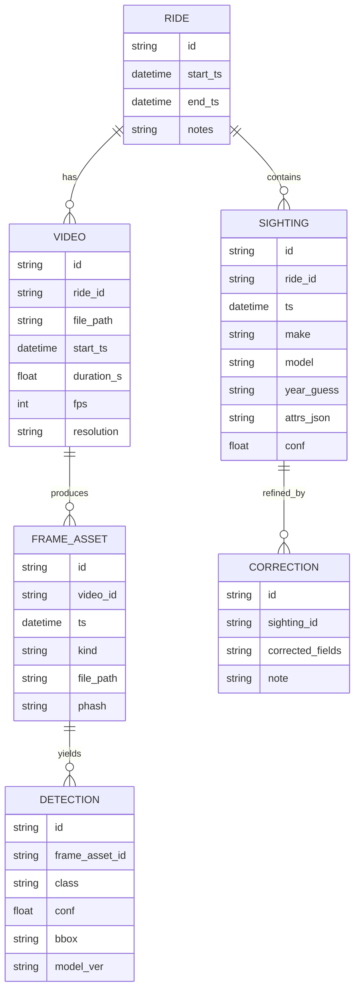

# CurbScout — local‑first “ride video → structured city intel”
A solo, local‑first pipeline that ingests your daily Insta360 GO 3S bike footage, extracts **car sightings** into a queryable database (make/model now; year/trim later), and evolves into “curb intelligence” (parking restrictions, street sweeping, hazards) with an Apple‑beautiful macOS UI and a modern web dashboard. [insta360](https://www.insta360.com/product/insta360-go3s)
https://blueoakcouncil.org/license/1.0.0
**Why this architecture:** you have an M4 Mac mini (24GB) and slow coax upload, so the system processes raw 4K locally and only syncs derived artifacts (JSON + crops + highlights) to GCP/DO; Vast.ai is reserved for training or huge batch runs.

***

## ELI15: what it does
You ride around with a tiny camera, come home, plug it in, and your Mac makes a “cars I saw today” report with timestamps and pictures; you can quickly fix wrong labels, and later it can also read parking signs and warn you about rules.

## Expert: what it really is
A spec‑driven, event‑sourced-ish perception pipeline: **ingest → segment → sample frames → detect → crop → classify → dedupe → persist → human‑in‑the‑loop corrections → exports → optional sync**, designed to stay cheap under constrained uplink and to scale by pushing only the expensive parts (training/batch) to rented GPUs.

***

## Hardware + constraints (your stack)
- Compute: M4 Mac mini (24GB) is the always‑on “factory” that ingests, runs inference when feasible, and hosts your review UI.
- Capture: Insta360 GO 3S + Action Pod (runtime depends on settings; Insta360’s own manual gives ~38 min camera‑only and ~140 min when used in the Action Pod under stated conditions). [onlinemanual.insta360](https://onlinemanual.insta360.com/go3s/en-us/faq/specs/battery)
- Cloud: GCP and/or DigitalOcean for cheap object storage + optional web hosting; avoid shipping raw 4K over coax by default.
- Burst GPU: Vast.ai for training/big batch jobs; Vast advertises “real‑time pricing” and claims 5–6× lower costs vs traditional cloud.

***

## Camera placement (cars-first)
### ELI15
Put it on your chest so it points where you look; it’s steadier than the handlebars and usually captures cars clearly. [youtube](https://www.youtube.com/watch?v=OxR-eRAdzG0)

### Expert notes
- **Primary mount: chest/centerline** for stable optical flow, consistent horizon, and fewer handlebar micro‑vibrations; keep a slight downward pitch to maximize plates/badges and reduce sky overexposure. [youtube](https://www.youtube.com/watch?v=YMWHDgWY__A)
- **Secondary: helmet POV** when you want a higher vantage (better over parked cars at intersections) but validate the lens isn’t occluded by straps/visor and accept more head jitter. [youtube](https://www.youtube.com/watch?v=OxR-eRAdzG0)
- **Safety/retention:** reviews commonly warn magnetic/wearable mounts can fail in rough use; add a mechanical backup tether when riding. [me.pcmag](https://me.pcmag.com/en/cameras-1/24131/insta360-go-3s)

***

## Phase 1 transfer (home Wi‑Fi / USB “drive mode”)
You explicitly want Phase 1 to be “get home → transfer,” so **no cloud dependency, no phone hotspot requirement** in MVP.

### Phase 1A (recommended): USB “U‑Disk / USB Drive Mode” to Mac
Insta360’s own manuals describe transferring by selecting **U‑Disk/USB Drive Mode**, then copying from `DCIM > Camera01` on the mounted drive. [onlinemanual.insta360](https://onlinemanual.insta360.com/go3/en-us/operating-tutorials/connect/files)

```bash
# Example local folder layout (create once)
mkdir -p ~/CurbScout/{raw,derived,exports,models}
```

### Phase 1B (optional): “SD card-like” offload via accessory workflow
The GO 3S uses internal storage (common transfer workflows are USB drive mode or accessory offload), but a “Quick Reader” style workflow exists and is sold by retailers around **$44.99** (budget ~$45) if you want faster offload without relying on camera Wi‑Fi. [cyclegear](https://www.cyclegear.com/accessories/insta360-go-3go-3s-quick-reader)

> Note: I’m not claiming the GO 3S literally has a removable SD card; treat this as “SD‑card‑style workflow” (fast removable media feel) using an accessory path, not an actual SD slot. [youtube](https://www.youtube.com/watch?v=Cw9vO8gnl4E)

***

## System diagrams (Mermaid)

### End-to-end dataflow
```mermaid
flowchart LR
  A[Ride + GO 3S capture] --> B[Home transfer (Phase 1)\nUSB Drive/U-Disk to Mac]
  B --> C[Ingest: checksum + catalog\nraw MP4 in ~/CurbScout/raw]
  C --> D[Segment + sample frames\n(keyframes / N fps)]
  D --> E[Detect vehicles\nbbox + confidence]
  E --> F[Crop evidence images\nthumbs + full crops]
  F --> G[Classify make/model\n(best-effort year/trim later)]
  G --> H[Deduplicate + track\n(per ride, per time window)]
  H --> I[Persist to SQLite\nsightings + detections + assets]
  I --> J[SwiftUI Review UI\nconfirm / correct labels]
  J --> K[Daily export bundle\nJSONL/CSV + highlight clips]
  K --> L[Optional sync (later phases)\nGCP/DO object storage]
  K --> M[Optional Vast.ai (later)\ntrain/batch -> new model]
```

### Component architecture (local-first)
```mermaid
flowchart TB
  subgraph Mac[M4 Mac mini (local-first)]
    W[Folder watcher\nIngest daemon]
    P[Pipeline runner\nsegment/sample/detect/classify]
    DB[(SQLite)]
    UI[SwiftUI macOS app\nReview/Correction]
    EX[Exporter\nreports + bundles]
    W --> P --> DB
    DB <--> UI
    DB --> EX
  end

  subgraph Cloud[Later phases: Cloud]
    OBJ[(Object Storage\nGCP/DO)]
    WEB[SvelteKit dashboard\n(optional)]
    GPU[Vast.ai GPU jobs\n(train/batch)]
  end

  EX --> OBJ
  OBJ --> WEB
  GPU --> OBJ
```

### Data model (minimum viable schema)


***

## Outputs (what you store + what you upload later)
### ELI15
Keep the big video files on your Mac; upload only the “small stuff” (pictures + text results) so your internet doesn’t choke.

### Expert notes
- **Local (always):** raw MP4, derived crops, keyframes, SQLite DB.
- **Cloud (later):** “daily bundle” = `sightings.jsonl` + thumbnails/crops + short highlight clips + an HTML report; this is the bandwidth win on coax.

***

## Car recognition scope (what’s realistic)
### ELI15
It will be good at “BMW 3 Series / Honda Civic,” and you’ll be able to fix mistakes quickly; exact year/trim/brake package comes later.  

### Expert notes (don’t skip this)
- **MVP target:** vehicle detection + make/model classifier with confidence + evidence crop per sighting.  
- **Year/trim/spec:** often not visible reliably in street footage (angles, glare, occlusion), so treat it as **best‑effort + user correction + later training**, not a guaranteed inference.  
- Your example “BMW 440i 2004” may be inconsistent (I’m guessing); build a “sanity check” that flags impossible year/badge combos for review.  

***

## UX: Apple-beautiful review (the product)
You prefer Apple‑grade UI and Swift, so the core experience is a **SwiftUI macOS app**: timeline scrubber + map + grid of crops, with one‑keystroke confirm and fast correction.
A SvelteKit dashboard comes later for browsing/analytics remotely, but the macOS app is what makes labeling fast enough for a solo project.

***

## Cloud + cost posture (GCP/DO + Vast.ai)
- Vast.ai should be “on-demand only”: training, large batch reprocessing, experiments; Vast markets real‑time pricing and claims large savings vs traditional clouds.
- Keep cloud storage as dumb/cheap as possible (object storage for derived artifacts); avoid always-on GPU servers.

**Price anchors you can budget today (USD):**
- Quick Reader retail example: **$44.99** at Cycle Gear (budget ~$45). [cyclegear](https://www.cyclegear.com/accessories/insta360-go-3go-3s-quick-reader)
- Vast.ai pricing varies by GPU/provider; treat it as hourly burst spend (their pricing page emphasizes “real-time pricing”).

***

## Parking restrictions (Santa Monica) — planned expansion
Santa Monica’s curb rules are nontrivial and change; the city explicitly announced the Clean Air Vehicle decal free-meter benefit expires **Sept 30, 2025** under the municipal code section cited in the press release. [santamonica](https://www.santamonica.gov/press/2025/09/23/local-parking-benefit-for-clean-air-vehicle-decals-expires-sept-30)
That’s a perfect “useful next” feature: detect parking signs → OCR → parse time windows → attach to a map tile/segment so you can answer “can I park here now?” later. [santamonica](https://www.santamonica.gov/press/2025/09/23/local-parking-benefit-for-clean-air-vehicle-decals-expires-sept-30)

***

## Roadmap (Phase 1 transfer first, then “autoupload” options)
### Phase 1 — Home transfer MVP (no cloud required)
- USB Drive/U‑Disk transfer to Mac; ingest into `~/CurbScout/raw`; generate derived crops + JSON; write SQLite; export daily report bundle. [onlinemanual.insta360](https://onlinemanual.insta360.com/go3s/en-us/camera/appuse/filetransfer)
- Use Insta360 runtime expectations to plan ride sessions (manual lists ~38 min camera only vs ~140 min in Action Pod under specified test conditions). [onlinemanual.insta360](https://onlinemanual.insta360.com/go3s/en-us/faq/specs/battery)

### Phase 2 — Optional “autoupload” behaviors (pick one later)
- (1) **Home Wi‑Fi only:** upload the daily bundle overnight.  
- (2) **Opportunistic via phone hotspot:** upload only JSON + a few thumbnails during the day; defer clips.  
- (3) **As-you-ride queued upload:** aggressive, but hard on coax/hotspot and battery; only makes sense if you need near-real-time.

### Phase 3 — Web dashboard (SvelteKit)
- Browse rides, sightings, heatmaps; share a static HTML report; optional auth.

### Phase 4 — Vast.ai training + active learning
- Export corrected labels → train/fine‑tune on Vast → pull model back to Mac → reprocess.

### Phase 5 — Curb intelligence
- Parking sign OCR, street sweeping detection, hazard mapping, bike lane obstruction analytics, storefront OCR diary, construction changes.

(These reuse the same “event timeline + evidence assets + corrections” DB design.)

***

## GitHub Spec Kit (how you keep it tight)
GitHub Spec Kit provides a spec-driven workflow with a `specify` CLI and structured artifacts (spec/plan/tasks/implementation) so your solo scope doesn’t explode. 

```bash
uvx --from git+https://github.com/github/spec-kit.git specify init curbscout
```

```text
/speckit.specify Build a local-first macOS app that ingests Insta360 GO 3S ride videos via USB Drive/U-Disk at home, extracts car sightings (make/model now, best-effort year/trim later), stores in SQLite, provides SwiftUI review/correction UI, and exports a daily report bundle (JSONL/CSV + crops + highlight clips). Cloud sync and Vast.ai training are later phases.
/speckit.plan Phase 1: home transfer + local pipeline + review UI. Phase 2+: autoupload modes, SvelteKit dashboard, Vast.ai training loop. Phase 5: parking sign OCR and rule parsing for Santa Monica.
```

***

## Safety / privacy defaults
- Default to **local-only** storage for raw video; sync only derived artifacts later to minimize exposure and bandwidth.
- If you later add plate OCR for dedupe, treat it as sensitive: hash/tokenize by default and keep raw text optional.

***

## Your open decision (required)
What exact “autoupload” behavior do you want after Phase 1: (1) only when you get home on Wi‑Fi, (2) opportunistic during the day via phone hotspot, or (3) as-you-ride to cloud (even if delayed/queued)?
